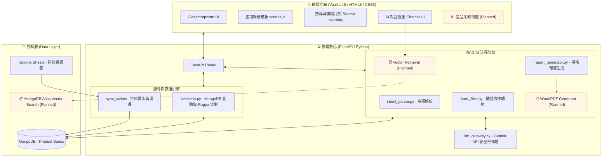
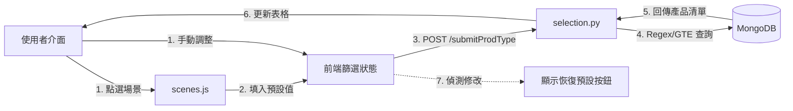
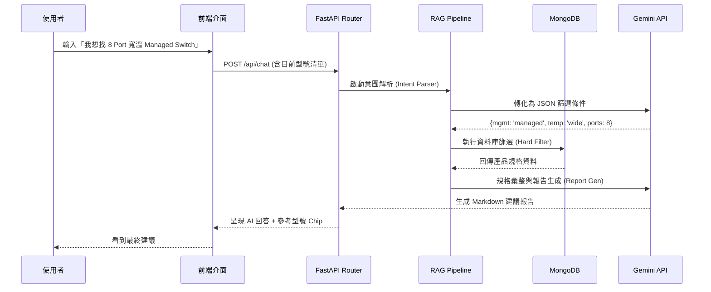
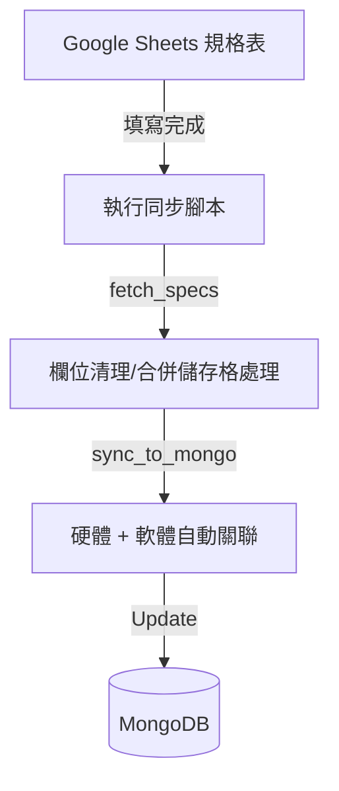

# 🏗️ Advantech AI Selection Tool - System Architecture

這份架構圖展示了系統的模組化結構。藍色區塊代表 **Sprint 1 已完成** 的功能，橘色虛線區塊代表 **Sprint 2 預計開發** 的 RAG 進階功能。

---

## 🔄 系統核心流程 (System Workflows)

為了呈現各模組間的連動，以下拆解為兩大核心路徑：

### 1. 條件篩選與場景套用流程 (Filter & Scene Flow)
這是使用者透過介面手動選型或套用模板的過程。

### 2. AI 互動與 RAG 處理流程 (AI Chatbot / RAG Flow)
這是使用者在對話視窗輸入自然語言時，系統內部的 3-Stage 處理過程。

### 3. 資料維護管線 (Data Maintenance)
RD 與 PM 維護規格資料的流程。

## 🧩 模組說明

### 1. 已完成部分 (Sprint 1)
- **Data-Driven 結構**：透過自動化腳本將 Google Sheets 複雜規格清洗並 Join 後存入 MongoDB。
- **混合篩選引擎**：
    - **手動模式**：支援 Port 數 GTE 查詢與 Management Type 的 Regex 模糊比對。
    - **場景模式**：由 `scenes.js` 提供預設條件，並具備「修改偵測」與「恢復預設」機制。
- **RAG 1.0 (Text-to-SQL)**：AI 能夠理解自然語言，將其轉為結構化的 MongoDB 指令（Intent Parsing），並輸出規格比較報告。
- **LLM Gateway**：具備自動重試與 API 日誌紀錄功能的 Gemini 核心介面。

### 2. 未來計畫 (Sprint 2+)
- **向量檢索整合**：導入 MongoDB Atlas Vector Search 處理 PDF 使用手冊，實現完整的 RAG 檢索增強生成。
- **自動化報告輸出**：將 AI 建議直接轉換為 Word 或 PDF 格式供業務下載。
- **橫向比較功能**：實作 UI 面板讓使用者能橫向對比多台設備細節。
