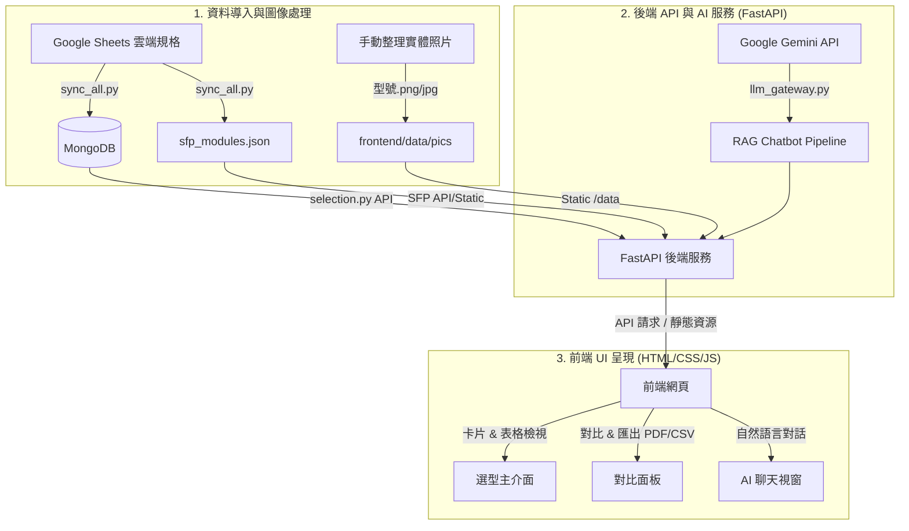

# 🤖 Advantech Industrial Switch AI Selection Tool (研華工業交換機智慧選型工具)

這是一個專為 Advantech 工業交換機設計的智慧型選型工具。結合了**多維度條件式篩選**、**產品規格對比**、**SFP 模組推薦**、**實體照片預覽**與 **RAG (Retrieval-Augmented Generation) AI 助手**，協助業務與客戶從數百種型號中精確找出符合需求的產品。

> 版本異動歷史請參閱 [CHANGELOG.md](CHANGELOG.md)。

---

## 🚀 專案核心流程與架構

本系統的運作流程可分為三個階段：**資料同步與圖像處理**、**後端 API 與 AI 服務**、以及**前端 UI 呈現**。



---

## 📋 前置作業 (Pre-requisites)

啟動本專案前，必須完成以下環境與金鑰配置：

### 1. 安裝 Python 環境與套件管理工具
本專案建議使用 `uv` 包管理器。請確保已安裝 Python 3.10+。
```bash
# 安裝依賴項並建立虛擬環境
uv sync
```

### 2. 資料庫與 API 服務準備
* **MongoDB**: 本專案使用 MongoDB 儲存整合後的規格資料。請使用 MongoDB Atlas 雲端服務或本機 MongoDB 實例。
* **Google Cloud Service Account**: 
  * 專案需要存取 Google Sheets API，請在 Google Cloud Console 建立服務帳戶。
  * 下載金鑰 JSON 檔案，命名為 `credentials.json`，並放置於 [configs/](file:///d:/OneDrive%20-%20advantech/Project/Advantech%20AI%20Selection%20Tool/configs/) 目錄下。
  * 請將您的服務帳戶 Email 加為 Google Sheet 的**檢視者 (Viewer)**。
* **Gemini API Key**: 用於 RAG Chatbot 意圖解析與報告生成，請前往 Google AI Studio 申請 API Key。

### 3. 配置環境變數
在 [configs/](file:///d:/OneDrive%20-%20advantech/Project/Advantech%20AI%20Selection%20Tool/configs/) 目錄下建立 `.env` 檔案（可參考根目錄 `.env.example`）：

```ini
# Google Sheets 設定
GOOGLE_SHEET_ID="您的_GOOGLE_SHEET_ID"
GOOGLE_CREDENTIALS_PATH="configs/credentials.json"

# MongoDB 設定
MONGO_URI="您的_MONGODB_連線字串"
MONGO_DB_NAME="advantech_ind_sw_tool"

# Gemini AI 與 RAG 設定
GOOGLE_API_KEY="您的_GEMINI_API_KEY"
EMBEDDING_MODEL="text-embedding-004"
```

> [!IMPORTANT]
> **金鑰路徑注意**：`.env` 與 `credentials.json` 必須嚴格放置在 `configs/` 資料夾下，系統中所有同步腳本與後端啟動時均已寫死讀取此相對路徑。

---

## 🛠️ 操作與準備步驟 (Step-by-Step Guide)

當基礎環境與 [configs/](file:///d:/OneDrive%20-%20advantech/Project/Advantech%20AI%20Selection%20Tool/configs/) 下的金鑰配置完成後，請依序執行以下步驟進行資料初始化與系統部署：

### STEP 1：執行雲端資料同步管線
本專案提供一鍵同步腳本，自動登入 Google Sheets，擷取硬體（`Ind. SW` / `Train SW` 工作表）、軟體規格（`SW Dead Pool` 工作表）、SFP 模組對照表（`SFP` 工作表），自動進行軟體系列推導與規格 Join，寫入 MongoDB 並產生 SFP 對照清單：
```bash
# 執行一鍵資料庫同步與驗證報告生成
uv run python scripts/sync_all.py
```
> 同步完成後可檢視 `data/validation_report.json`，確認是否有無法自動配對的產品型號。

### STEP 2：放置產品實體照片 (圖片管理)

本選型工具支援展示交換機實體縮圖與 Hover 放大預覽。請直接將整理好的產品照片放置於 [frontend/data/pics/](file:///d:/OneDrive%20-%20advantech/Project/Advantech%20AI%20Selection%20Tool/frontend/data/pics/) 目錄下：

* **命名規範**：將照片命名為 **`型號.png`** 或 **`型號.jpg`**（例如：`EKI-7710G.png` 或 `EKI-5729F.jpg`，需與資料庫中的 Model Name 完全一致）。
* **格式建議**：建議採用去背透明背景的 PNG 圖檔，以融入系統毛玻璃 (Glassmorphism) 的高質感設計。

### STEP 3：啟動後端 FastAPI 伺服器
若要在區域網路內提供服務（例如允許其他電腦連線），啟動時請務必指定 `--host 0.0.0.0`：
```bash
# 啟動 Uvicorn 伺服器 (開發模式帶 reload)
uv run uvicorn app.main:app --reload --host 0.0.0.0
```

### STEP 4：設定 Cloudflare Tunnel (外部連線與部署必備)
為了讓部署在 GitHub Pages 的公開前端網頁能夠安全存取位於您內網/本機的後端 API，必須建立 Cloudflare Tunnel 隧道：

1. **安裝 cloudflared**：前往 [Cloudflare Releases](https://github.com/cloudflare/cloudflared/releases) 下載並安裝適用您系統的安裝包（如 Windows 的 `cloudflared-windows-amd64.msi`）。
2. **授權登入**：在終端機中執行 `cloudflared tunnel login`，並在瀏覽器中授權您的 Cloudflare 託管網域（免費方案帳戶即可）。
3. **建立隧道**：
   ```powershell
   cloudflared tunnel create advantech-tool
   ```
   記下產生的 **Tunnel ID**，其憑證 JSON 檔會存放於 `~/.cloudflared/` 目錄。
4. **配置設定檔**：在用戶目錄下建立設定檔 `%USERPROFILE%\.cloudflared\config.yml`：
   ```yaml
   tunnel: <您的 Tunnel ID>
   credentials-file: C:\Users\<您的使用者名稱>\.cloudflared\<Tunnel ID>.json
   
   ingress:
     - hostname: api.namecheapest.cc       # 對外公開的 API 域名 (替換為您的網域)
       service: http://localhost:8000      # 轉發至本地 FastAPI 埠
     - service: http_status:404
   ```
5. **配置 DNS 路由映射**：將公開域名導向您所建立的 Tunnel：
   ```powershell
   cloudflared tunnel route dns advantech-tool api.namecheapest.cc
   ```
6. **啟動加密隧道**：
   ```powershell
   cloudflared tunnel run advantech-tool
   ```
   > [!TIP]
   > **設定開機自啟**：以管理員權限執行 `cloudflared service install`，可將其設定為 Windows 系統背景服務。

### STEP 5：部署 GitHub Pages 靜態前端
1. **推送代碼至倉庫**：將專案推送至您的 GitHub 倉庫（請再次確認機密檔 `.env` 及 `credentials.json` 未被推送）。
2. **更新 API 設定**：編輯 [frontend/js/config.js](file:///d:/OneDrive%20-%20advantech/Project/Advantech%20AI%20Selection%20Tool/frontend/js/config.js)，將 `CLOUDFLARE_API_URL` 設定為您的 Cloudflare Tunnel 網址：
   ```javascript
   const CLOUDFLARE_API_URL = 'https://api.namecheapest.cc';
   ```
3. **啟用 Pages 功能**：到 GitHub Repo 的 **Settings** -> **Pages** 頁面：
   * **Source** 選擇 `Deploy from a branch`。
   * **Branch** 選擇主分支（如 `master`），目錄選擇 `/frontend`。
   * 儲存設定後，GitHub Actions 會自動編譯並部署，數分鐘後即生成您的公開選型網站網址。

   > [!NOTE]
   > **CORS 安全性建議**：後端預設在 [app/main.py](file:///d:/OneDrive%20-%20advantech/Project/Advantech%20AI%20Selection%20Tool/app/main.py) 中開啟 `allow_origins=["*"]` 以利測試。部署完畢後，建議將跨來源許可限縮為特定的 GitHub Pages 網址與本地端以提高安全性。

### STEP 6：瀏覽與存取前端 (三種入口)
* **入口 A：本機直接存取（開發與單機使用首選）**
  * 網址：`http://localhost:8000/frontend/`
* **入口 B：Cloudflare Tunnel 外部部署存取**
  * 網址：`https://api.namecheapest.cc`（需啟動 FastAPI 與 Cloudflare Tunnel 服務）
* **入口 C：GitHub Pages 公開託管**
  * 網址：`https://<您的帳號>.github.io/Advantech-AI-Selection-Tool/`

---

## 🌟 系統核心功能介紹

### 1. 智慧選型與多維度篩選
* **動態關鍵字搜尋 (Search Inventory)**：即時模糊掃描資料庫中的硬體特徵（Power Input / Connector Type / Port
  Feature / Hardware Feature / Certifications），支援自動優先顯示「開頭匹配」型號。
  > [!NOTE]
  > 軟體規格資料（VLAN、Spanning Tree、SNMP 等）尚未確認完成，目前暫時不納入 Search Inventory 與 Advanced
  > Filter，詳見 [CHANGELOG.md](CHANGELOG.md)。
* **進階功能篩選 (Advanced Filter)**：以卡片分類瀏覽硬體條件——Port Type / Connector、Power Input、
  Certifications、Hardware Specs，避免與左側 Wizard 既有步驟（PoE Required、Interface Type、Max Port Speed）
  重複。
* **應用場景快速引導 (Scene Templates)**：內建鐵路車載 (EN 50155)、電力系統 (IEC 61850) 等四大情境。提供必選與建議條件的分級載入，支援一鍵還原。
* **衝突條件警告 (Culprit Items)**：當選取的特徵組合導致無任何產品符合時，系統以紅色標示出造成無結果的「元凶條件」，降低認知負擔。

### 2. 雙維度切換：卡片清單與表格檢視
* **卡片檢視 (List View)**：Glassmorphism 視覺風格，卡片會動態生成關鍵 Badges（網管類型、工作溫度、PoE 總數、SFP 模組引導、場景驗證 ✓、認證標章 CE/FCC 等）。
* **表格檢視 (Table View)**：方便橫向掃描規格。支援動態選取欲顯示的欄位（Column Picker），欄位依介面類型分群顯示（RJ-45 藍、Fiber 綠、M12 橙色底色），並依產品介面組合（RJ-45 / RJ+Fiber / RJ+M12 等）自動分層排序（Tier Sort）。序號、產品型號在水平滾動時自動固定（Sticky），表頭亦採凍結表頭 + 內部捲動設計，搭配壓縮列高，一屏可瀏覽更多筆資料。管理類型以縮寫徽章（U/L2/L3...）顯示於型號旁，Certifications 為獨立可開關欄位。

### 3. SFP 光纖選型導航面板 (SFP Selector)
* 卡片上設有 SFP 可選型捷徑，切換至 SFP 頁籤時會動態推導該設備的光口速度（100M/1G/10G），並拉取靜態資料推薦相容的 SFP 模組清單。
* 針對固定接頭（SC/ST 等非 SFP 插槽）提供對應選線與單/多模跳線建議。

### 4. 產品多台規格對比與 PDF/CSV 匯出
* **產品對比 (Product Compare)**：可勾選 1 至 5 台產品拉出側拉面板進行橫向比對，並以橘黃色底色**高亮規格差異欄位**。
* **AI 對比摘要**：對比面板整合 RAG AI 摘要（`compare_summary.py`），自動生成各機型關鍵差異分析（Key
  Differences）與整體選型建議（Recommendation）。
* **多格式報表**：對比面板內整合 CSV 規格下載與呼叫後端 API 動態生成的 PDF 規格書報表（含 AI 摘要段落）。單台設備亦可直接匯出。

### 5. 官方產品連結導流與實體照片 Hover 預覽
* **研華官網直達**：卡片型號旁、展開卡片底部 CTA 及 SFP 推薦晶片上，均設有外部連結圖示 `↗`，點擊即可直達官網（支援以型號自動拼湊搜尋連結的 Fallback 機制）。
* **照片預覽**：滑鼠懸停於卡片左側的縮圖上，會動態浮現該交換器的實體清晰大圖預覽。

### 6. 上下文鎖定 AI 選型助手 (RAG Chatbot)
* **上下文感知對話**：AI 會自動讀取並鎖定當前頁面篩選出的型號清單，回答使用者的規格比較與分析提問。
* **非阻塞執行 (Non-blocking)**：後端將同步 LLM 請求交由 FastAPI 內建的 Thread Pool 執行，確保 Chatbot 在思考時，前端的篩選與模糊搜尋依然保持「毫秒級」流暢反應。

---

## 📂 專案目錄架構說明

```text
.
├── .github/workflows/
│   └── deploy-pages.yml  # GitHub Actions 自動部署至 GitHub Pages 工作流
├── app/
│   ├── api/           # API 端點 (selection:選型, chat:AI對話, compare:對比, report:PDF/CSV匯出)
│   ├── models/        # Pydantic 資料模型定義
│   ├── rag/           # RAG 核心管線 (意圖解析、動態條件過濾、LLM報告生成、compare_summary:AI對比摘要)
│   ├── database.py    # MongoDB 連線封裝
│   ├── llm_gateway.py # LLM 統一閘道器（具 RPM 限流防護與 Retry 機制）
│   └── main.py        # FastAPI 入口（含前端靜態檔案無快取控制中間件）
├── configs/           # 機密金鑰與設定檔目錄（已被 .gitignore 忽略）
│   ├── .env           # 專案環境變數與連線字串
│   └── credentials.json # Google 服務帳戶認證 JSON
├── data/              # 暫存與同步資料目錄
│   ├── hardware_specs_raw.json  # 從 Sheets 抓取的原始硬體資料
│   ├── software_specs_raw.json  # 從 Sheets 抓取的原始軟體資料
│   └── validation_report.json   # 規格同步後的配對驗證報告
├── frontend/
│   ├── css/           # 樣式表目錄 (style.css, table-view.css, compare.css 等)
│   ├── data/          # 前端靜態資料目錄
│   │   ├── pics/      # [NEW] 產品照片目錄，需依型號命名放置於此 (提供網頁展示，例如 EKI-7710G.png)
│   │   └── sfp_modules.json # 從雲端 SFP Sheet 同步下來的相容模組清單
│   ├── js/            # 前端 JavaScript 邏輯模組
│   │   ├── app.js     # 前端主控制邏輯（含 Table View 欄位群組、Tier 排序、Fiber 自動顯示）
│   │   ├── compare.js # 產品對比、AI 摘要顯示與底部 padding 動態計算邏輯
│   │   ├── config.js  # Cloudflare Tunnel API 終端設定
│   │   ├── feature-selector.js # 進階功能選擇器 (Feature Selector) 控制
│   │   ├── scenes.js  # 應用場景模板定義
│   │   └── sfp-selector.js  # SFP 模組動態過濾推薦與選線邏輯
│   ├── index.html     # GitHub Pages 使用的相對路徑入口網頁
│   └── select_ui_with_options_claude.html # 後端掛載使用的絕對路徑網頁
├── scripts/           # 資料維護與診斷腳本目錄
│   ├── fetch_hardware_specs.py  # 擷取 Sheets 硬體規格
│   ├── fetch_sw_specs.py        # 擷取 Sheets 軟體功能 (指向 "SW Dead Pool")
│   ├── sw_index.py              # 資料庫動態特徵掃描診斷工具
│   ├── sync_all.py              # 一鍵自動化同步管線（Sheets -> MongoDB & JSON）
│   └── sync_specs_to_mongo.py   # 合併規格並匯入至 MongoDB
└── README.md          # 專案說明文件
```

---

## 🔍 診斷與測試工具 (Diagnostics)

在資料同步或更新後，您可以使用以下腳本進行健康檢查：

### 1. 資料庫動態特徵索引診斷
檢查資料庫中是否存在有效的規格，並確認被動態讀取為進階搜尋與 Feature Selector 中的軟體功能總數：
```bash
uv run python scripts/sw_index.py
```

---
© 2026 Advantech | AI Selection Tool Project
